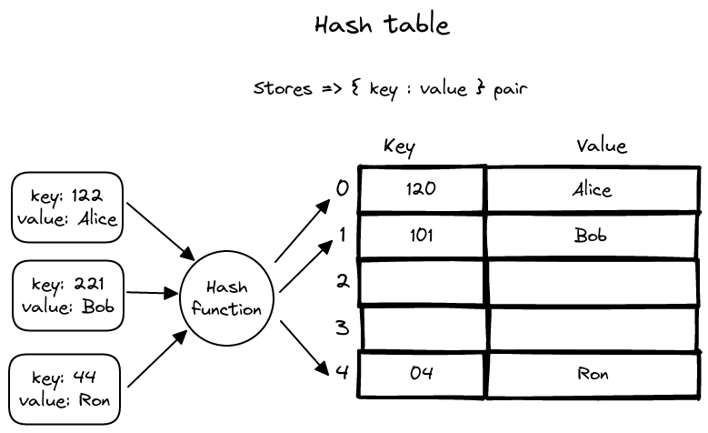

## Hash table

A hash table is one of the main data structure that stores **_key-value_** pairs. The key is passed on to a hash function that performs arithmetic operations to transform keys into array indices. The result (commonly known as hash value or hash) is the index of the key-value pair in the hash table.

### Hash function

It is a function that can transform any given **_key_** into an integer value **_index_** of an array.
