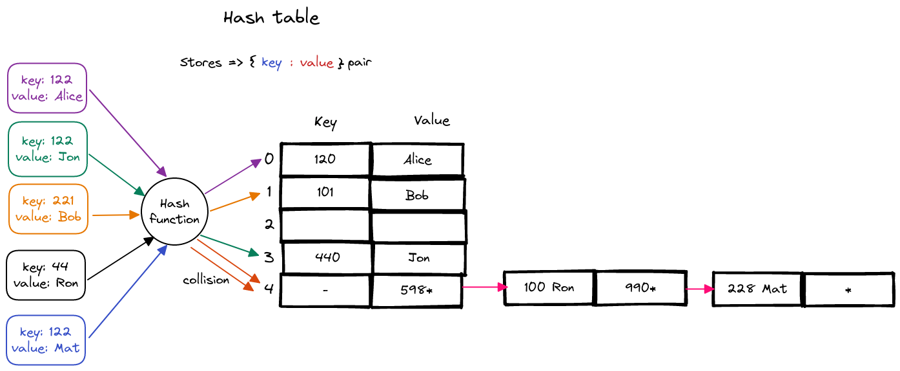

## Hash table

A hash table is one of the main data structure that stores **_key-value_** pairs. The key is passed on to a hash function that performs arithmetic operations to transform keys into array indices. The result (commonly known as hash value or hash) is the index of the key-value pair in the hash table.

We can use an array to implement it, by interpreting the **_key_** as an array index so that we can store the associated **_value_** in that position. However, in cases where the keys are large and cannot be used directly as an index, that is when hashing is used.

### Hash function

It is a function that can transform any given **_key_** to an integer value in the range [0, N-1], where N is the capacity of the bucket array (each cell of Hash table is considered as "bucket") for the hash table. Which can be used as an **_index_** for Hash table. There is also the possibility of two or more entries will be mapped to the same bucket, it is called **_Collision_**.

### Resolving collision

When such collision occurs, there are two options to handle it.

- **Open Addressing** - Use another location in the hash table.
- **Separate Chaining** - Change the structure of the hash table so that each array location can represent more than one value.

### More info

- [Basics of Hash tables](https://www.hackerearth.com/practice/data-structures/hash-tables/basics-of-hash-tables/tutorial/)
- [Hash tables - Algorithms Princeton](https://algs4.cs.princeton.edu/34hash/)
- [Hashing](https://www.cpp.edu/~ftang/courses/CS240/lectures/hashing.htm)
