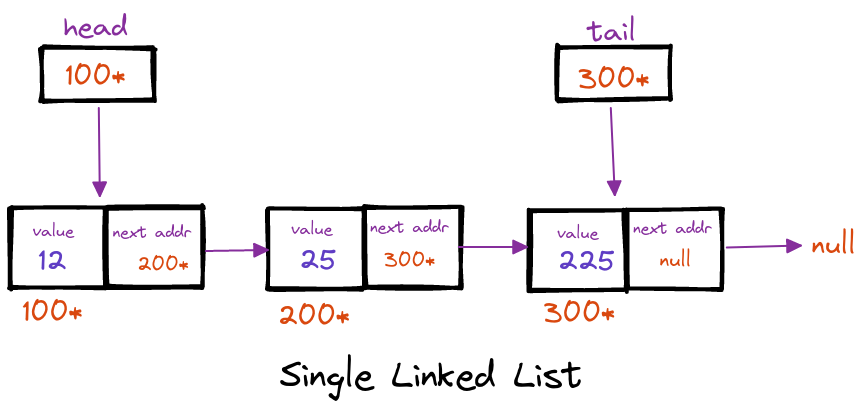

### Single Linked List

A singly linked list is a unidirectional type of linked list, that is, it can be traversed in only one direction from head to the tail (last node) tail.

Each element in a single linked list is called as node. A single node contains **_data_** and a pointer to the **_next_** node.

The first node is called the head; it points to the first node of the list and helps us access every other element in the list. The last node, also sometimes called the tail, points to NULL which helps us in determining when the list ends.
