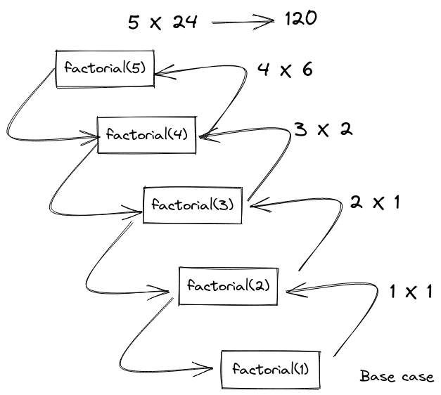

### What is Recursion ?

A process (a function in our case) that calls itself.

### Essential part of a recursive function

- Base Case
- Different input

### What is the base case ?

The condition where the recursion ends. Stops a recursive function from executing endlessly.

### How does it works ?

Invoke the same function with a different input until you reach your base case. When a function has been invoked it is automatically added to the Call Stack (call stack is a mechanism to keep track of the point to which each active subroutine should return control when it finishes executing). When ever the call stack hits a **RETURN**, it pops the current function off from the stack and gives back the control to the function that has been called.

```typescript
function factorial(num: number): number {
  // base case
  if (num <= 1) return 1;
  // calling the same function with different inputs
  else return num * factorial(num - 1);
}

console.log(factorial(5)); //=> 120
```

#### Pseudo code:

```text
factorial(5)
    return 5 * factorial(4)
                    4 * factorial(3)
                            3 * factorial(2)
                                    2 * factorial(1)

                                            return 1;

                                    2 *  1
                            3 * 2
                    4 * 6
            5 * 24
  120
```

<p align="center">

</p>

### Where things can go wrong ?

- No base case
- Forgetting to return o returning the wrong thing
- stack overflow

### Tips

- For arrays, make use of methods like **slice**, **spread operator**, and **concat** so that it makes copies of arrays and not mutate them.
- Strings are immutable so no need to use methods like **slice**, **spread operator**, and **concat**
- To make copies of objects use **Object.assign** or the **spread operator**
